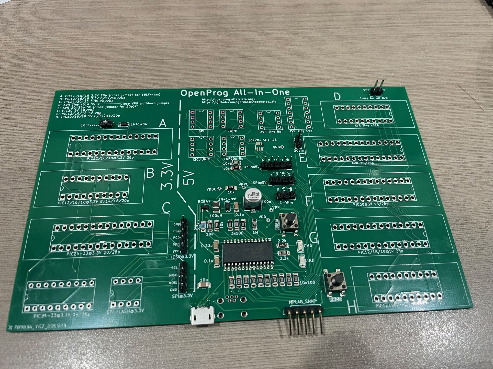
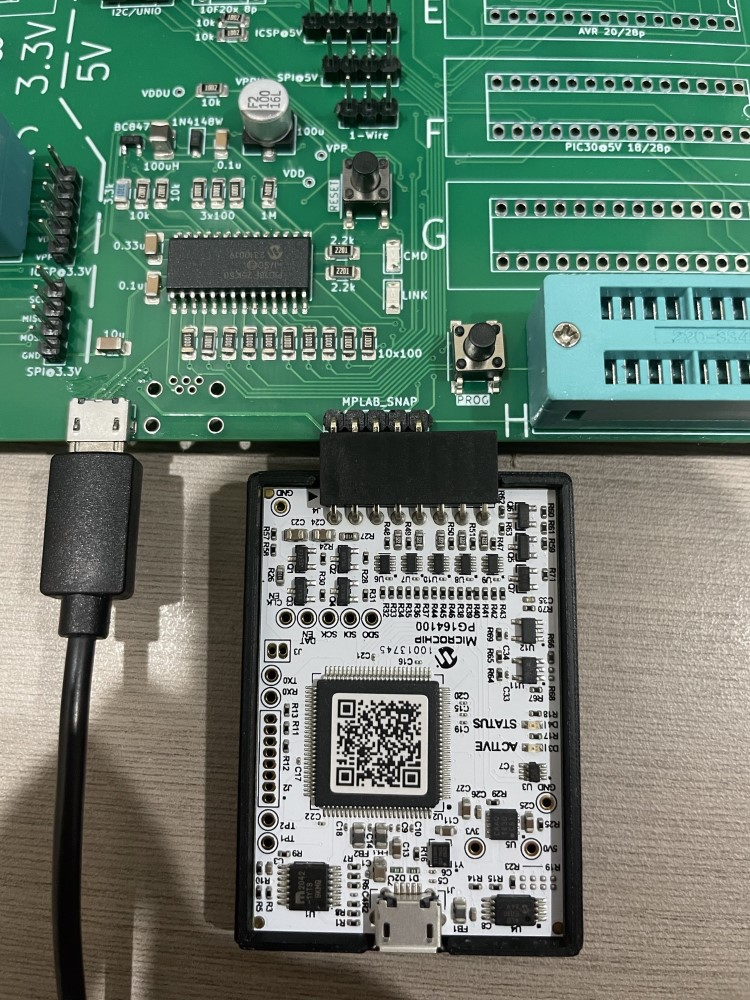
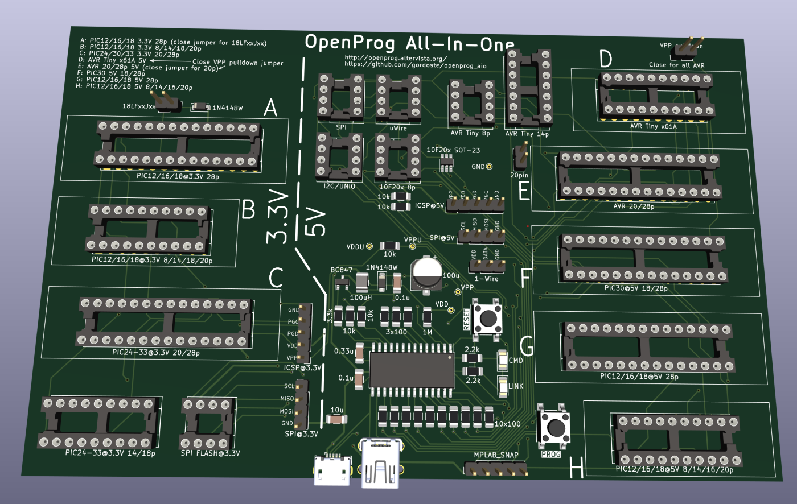

# openprog_aio
All-in-one variant of Alberto Maccioni's wonderful Openprog PIC/AVR programmer (http://openprog.altervista.org/).

## Benefits

For low-voltage programming, the big advantage of this programmer over something like the MPLAB Snap is that it can provide power to the target device, and all of the surrounding circuitry (bypass caps, etc.) is built onto the board. You just plug in a device and program it.

The programmer is also fully capable of high-voltage programming. This is essential if you need to program an older device, and it also means you can use the MCLR pin as an extra I/O, which can be very handy on low-pin-count devices.

This version is aimed at allowing you to get started for the lowest cost and without making your own PCBs. Therefore, the following changes have been made from the original project:

* No adapter boards - just one board, making it cheaper to order from PCB fabrication shops.
* Board is still reasonable size at 158x100mm - approx twice the size of the original project's main board
* Designed to be easily hand-soldered, with 1206 size SMD components. The trickiest thing to solder is the USB socket. You shouldn't need any special equipment if you have clear vision and good lighting - just 0.3mm solder, flux paste and de-soldering braid. NOTE: If you are hand-soldering, it is recommended to use a USB Mini-B socket - see [Part List](#part-list).
* Documentation is on the board, including clear delineation between 5V/3.3V
* Ability to use ZIF sockets for all 20/28 pin sockets if desired.
* PROG button can be used even if device is programmed in low-voltage mode (previously it was attached to RE3/#MCLR)
* ICSP inputs match the MPLAB Snap pinout (different from PICKit).

Please note that the 40-pin Wide DIP sockets have been removed as those devices are rarely used now and took up too much room. If you want to program those devices, you can easily connect the ICSP output to a breadboard.

## Before you start

You need temporary access to a PIC programmer to construct this project. If you don't have a friend with a programmer, the MPLAB Snap is the cheapest commercial option.

## Schematic

The schematic is [here](schematic.pdf).

## Firmware

The original firmware uses unsupported tooling (MCC). I have ported the firmware to MPLAB X and it is available at <https://github.com/gordoste/openprog>. All testing of this board is conducted using this firmware, and testing status of the board/firmware combo can be found at the firmware repository.

## Part List

You can copy and paste [this part list](bom/partlist.txt) into Mouser's BOM tool to order the passive components and semiconductors. In addition to those, you will need the following which are best ordered from AliExpress or similar:
1. IC sockets. You may wish to only populate the sockets you use. Here is a list of all of the sockets:
   | Socket ID | Socket pin count | Device family | Voltage | Device pin count | Can be ZIF? |
   | ----------|------------------|---------------|---------|------------------|-------------|
   | A | 28 | PIC12/16/18 | 3.3V | 28 | Y  |
   | B | 20 | PIC12/16/18 | 3.3V | 8/14/18/20 | Y |
   | C | 28 | PIC24/30/33 | 3.3V | 20/28 | Y |
   | D | 20 | AVR Tiny x61A | 5V | 20 | Y |
   | E | 28 | AVR | 5V | 20/28 | Y |
   | F | 28 | PIC30 | 5V | 18/28 | Y |
   | G | 28 | PIC12/16/18 | 5V | 28 | Y |
   | H | 20 | PIC12/16/18 | 5V | 8/14/16/20 | Y |
   | - | 18 | PIC24-33 | 3.3V | 14/18 | N |
   | - | 8  | SPI Flash | 3.3V | 8 | N |
   | - | 8  | SPI Flash | 5V | 8 | N |
   | - | 8  | uWire Flash | 5V | 8 | N |
   | - | 8  | I2C/UNIO Flash | 5V | 8 | N |
   | - | 8  | PIC 10F20x | 5V | 8 | N |
   | - | 8  | AVR Tiny | 5V | 8 | N |
   | - | 14 | AVR Tiny | 5V | 14 | N |
2. 2.54mm (0.1") pitch pin headers. 3 x 2-pin, 3 x 5-pin, 2 x 4-pin and 1 x 3-pin (all straight). Optionally, you can use a 90-degree header for the 5-pin MPLAB Snap connector.
3. one 6x6mm SMD push button for the PROG button (two if you choose to fit the RESET button)
4. USB socket - either thru-hole Mini-B (I got some from AliExpress which worked fine) or SMD Micro-B (GCT part # USB3076-30-A) (this has fine-pitch pins and is not easy to hand-solder).

## Construction Notes

Download the [ZIP file](https://github.com/gordoste/openprog_aio/releases/download/v1.0b/Openprog_All-in-one_1.0b.zip) containing the PCB gerber files and submit it to your favourite production house.

You can use [this interactive BOM](ibom.html) to assist in placing parts.

Assuming you are hand-soldering, solder the parts in the following order:
1. Back side: Transistors, diodes, resistors, capacitors, regulator
2. Front side: Transistors, diodes, resistors, LEDs, ceramic capacitors, inductor, PIC18F25K50, button(s), electrolytic cap, USB socket, pin headers.

Be careful to only apply a small amount of solder when soldering the USB socket, as it is very easy to create a bridge. Don't panic if you do - turn your soldering iron up a bit hotter than normal, apply a liberal amount of flux and then use desolder braid to try to get rid of __all__ of the solder from the bridged pins. Once it's cleaned up, try again with less solder.

After you've soldered everything, download the HEX file from the [firmware repository](https://github.com/gordoste/openprog) and program it onto the PIC. The marked "MPLAB_SNAP" connector matches the pinout of the Snap (as shown below) - if you're using a PICKit then you will need to utilise jumper wires to connect the programmer.

Assuming you've done everything right, when you plug it into your PC, it should show up as "Open Programmer" and the openprog GUI should be able to talk to it. I recommend using the command line "op" tool with the "-HWtest" option to run through basic checks before actually trying to program anything. See the [openprog webpage](http://openprog.altervista.org/) for more information.

