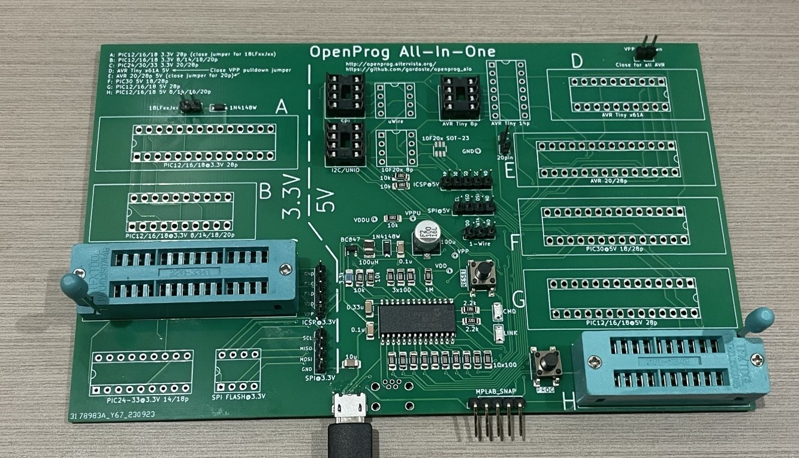

# openprog_aio
All-in-one variant of Alberto Maccioni's wonderful Openprog PIC/AVR programmer (http://openprog.altervista.org/).

This version is aimed at allowing you to get started for the lowest cost and without making your own PCBs. Therefore, the following changes have been made:

* No adapter boards, making it cheaper to order from PCB fabrication shops.
* Board is still reasonable size at 158x100mm - approx twice the size of the original mainboard
* Designed to be easily hand-soldered, with 1206 size SMD components. The trickiest thing to solder is the USB socket. You shouldn't need any special equipment if you have clear vision and good lighting - just 0.3mm solder, flux paste and de-soldering braid. NOTE: If you are hand-soldering, it is recommended to use a USB Mini-B socket - see [Part List](#part-list).
* Documentation is on the board, including clear delineation between 5V/3.3V
* Ability to use ZIF sockets for all 20/28 pin sockets if desired.
* PROG button can be used even if device is programmed in low-voltage mode (previously it was attached to RE3/#MCLR)
* ICSP inputs match the MPLAB Snap pinout (different from PICKit). This is the cheapest commercially available programmer.

Please note that the 40-pin Wide DIP sockets have been removed as those devices are rarely used now and took up too much room. If you want to program those devices, you can easily connect the ICSP output to a breadboard.

## Firmware

The original firmware uses unsupported tooling (MCC). I have ported the firmware to MPLAB X and it is available at <https://github.com/gordoste/openprog>. All testing of this board is conducted using this firmware.

## Construction Notes

Assuming you are hand-soldering, solder the parts in the following order:
1. Back side: Transistors, diodes, resistors, capacitors, regulator
2. Front side: Transistors, diodes, resistors, LEDs, ceramic capacitors, inductor, PIC18F25K50, button(s), electrolytic cap, USB socket, pin headers.

Be careful to only apply a small amount of solder when soldering the USB socket, as it is very easy to create a bridge. Don't panic if you do - turn your soldering iron up a bit hotter than normal, apply a liberal amount of flux and then use desolder braid to try to get rid of __all__ of the solder from the bridged pins. Once it's cleaned up, try again with less solder.

## Part List

Here is a Mouser BOM (in progress...) for the passive components and semiconductors. You should consider rounding quantities of passives (Rs and Cs) up to a minimum of 10 to get a better price. In addition to those, you will need the following which are best ordered from AliExpress or similar:
1. IC sockets. You may wish to only populate the sockets you use. Here is a list of all of the sockets:
   | Socket ID | Socket pin count | Device family | Voltage | Device pin count | Can be ZIF? |
   | ----------|------------------|---------------|---------|------------------|-------------|
   | A | 28 | PIC12/16/18 | 3.3V | 28 | Y  |
   | B | 20 | PIC12/16/18 | 3.3V | 8/14/18/20 | Y |
   | C | 28 | PIC24/30/33 | 3.3V | 20/28 | Y |
   | D | 20 | AVR Tiny x61A | 5V | 20 | Y |
   | E | 28 | AVR | 5V | 20/28 | Y |
   | F | 28 | PIC30 | 5V | 18/28 | Y |
   | G | 28 | PIC12/16/18 | 5V | 28 | Y |
   | H | 20 | PIC12/16/18 | 5V | 8/14/16/20 | Y |
   | - | 18 | PIC24-33 | 3.3V | 14/18 | N |
   | - | 8  | SPI Flash | 3.3V | 8 | N |
   | - | 8  | SPI Flash | 5V | 8 | N |
   | - | 8  | uWire Flash | 5V | 8 | N |
   | - | 8  | I2C/UNIO Flash | 5V | 8 | N |
   | - | 8  | PIC 10F20x | 5V | 8 | N |
   | - | 8  | AVR Tiny | 5V | 8 | N |
   | - | 14 | AVR Tiny | 5V | 14 | N |
2. 2.54mm (0.1") pitch pin headers. 3 x 2-pin, 3 x 5-pin, 2 x 4-pin and 1 x 3-pin (all straight). Optionally, you can use a 90-degree header for the 5-pin MPLAB Snap connector.
3. one 6x6mm SMD push button for the PROG button (two if you choose to fit the RESET button)
4. USB socket - either thru-hole Mini-B (I got some from AliExpress which worked fine) or SMD Micro-B (GCT part # USB3076-30-A) (this has fine-pitch pins and is not easy to hand-solder).

## Board photo
!

